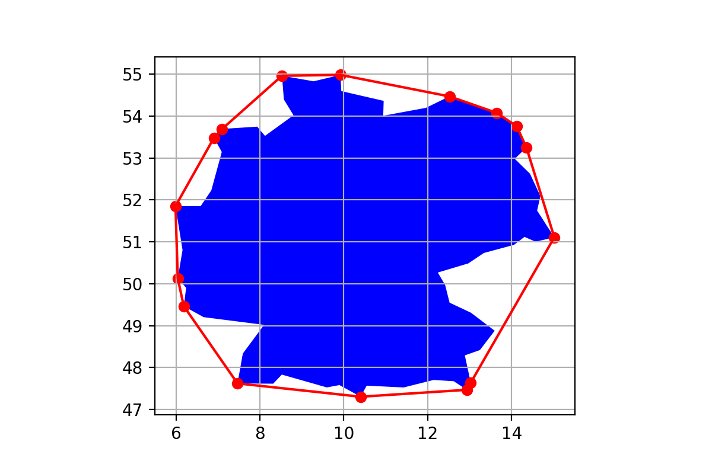
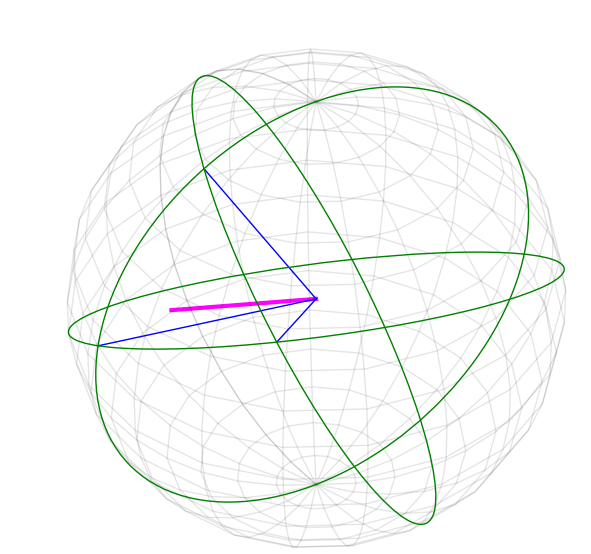
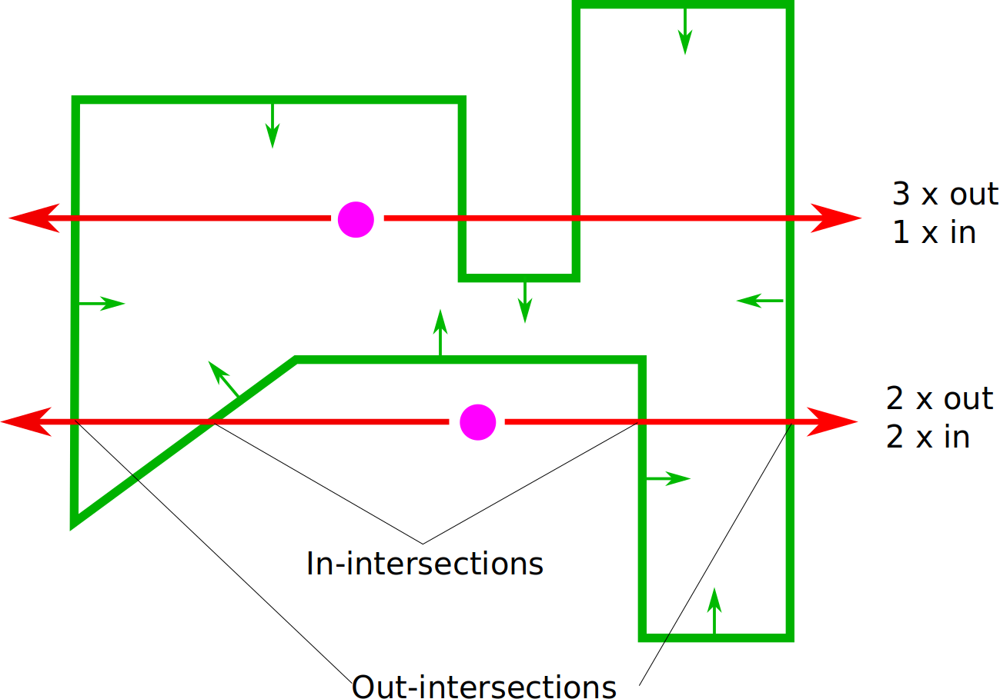
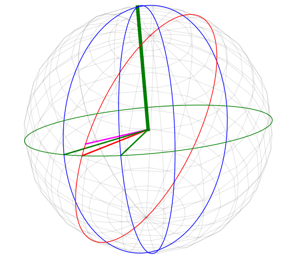
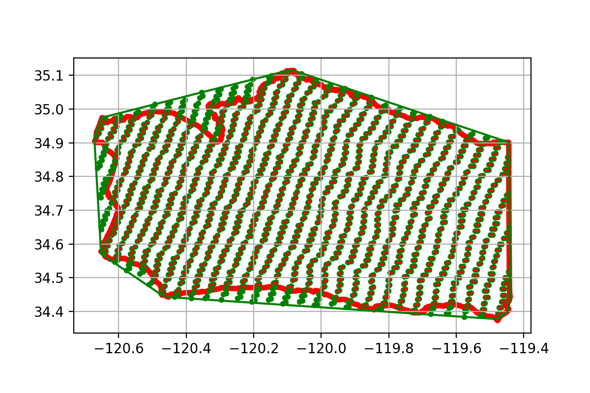

# SphereGIS:

When working with ungridded remote sensing data, such as MOD09 or VNP03, extracting the information we are interested in from a set of granules is a challenging hurdle.
Often times we are confronted with a large set of granules that intersect our region of interest, but also contain areas we are not interested in. We therefore need a performant method to subset the granules to our region of interest (ROI). 


The geolocation information for the data in the ungridded granules are typically given as WGS84 coordinates.
At sufficiently low latitudes and small enough ROIs, we may choose to treat the coordinates as an 
[Equirectangular](https://en.wikipedia.org/wiki/Equirectangular_projection) grid. 
To increase fidelity, we alternatively may choose to project our data into a locally valid grid.
For both approaches, we then may use well understood 2D subsetting and/or indexing techniques (such as manual bounding boxes or [r-trees](https://en.wikipedia.org/wiki/R-tree)).

However, if our ROI increases in size (or is closer to the poles for the Equirectangular grid), we may tap into situation where it matters if we perceive the ROI's edges as great circles or as rhumb lines.
Further, if our ROI consists of a spatially spread set of polygons, the approach of projecting into locally valid grids becomes tedious. 

A more preferable approach determines spatial relations with a consistent method without the need for map projections, whilst conceiving the boundaries of our ROI as great circles.

## Given are:

* A very large set of points p.
* A spherical polygon P defined by its nodes N and its edges E.

## Goal:
* Find the subset of p that are within P.
* Avoid 2D projection. All spatial relation tests are on a sphere. 
* Do the above in a performantly fashion allowing to subset trillions of points on consumer hardware (consciously vague specs).

## Challenge: 
Both the points and the polygon are on the surfaces of a sphere (rather than in 2D cartesian space), which means that the edges E are great circle segments rather than rhumb line segments.

Point-in-polygon tests on a sphere are similar to point-in-polygon tests in cartesian space ([Locating a point on a spherical surface relative to a spherical polygon of arbitrary shape](http://doi.org/10.1007/BF00894449)), but appear to be more computationally expensive. PostGIS implements spherical point-in-polygon tests through [geographies](https://postgis.net/workshops/postgis-intro/geography.html).
To make it feasible to determine the subset of a very large set of p that is within P, we want to reduce the search space by cropping the set of points to candidates points prior to the spherical point-in-polygon tests.


# Approach:

## Convex Hull
There seems to be an opportunity to quickly retrieve candidate points through intersects test with the spherical convex hull of the polygon:



* Let all points be represented as [ECEF](https://en.wikipedia.org/wiki/ECEF) vectors.
* A point that is within a polygon is also within the polygon's convex hull.
* The edges of a spherical convex hull are great circles. 
* A great circles that passes through two points is given by the cross product of the two points.
* A great circle can be seen as a plane dividing the sphere into two hemisphere. More precisely, the great circle (read: the great circle's normal vector) has a direction, _identifying_ a hemisphere.
* A point is within the convex hull if it is in each one of the hemispheres defined by each convex edge.
* A point is on the hemisphere defined by a great circles if the dot product of the great circle's normal vector and the point is positive.




The three green nodes span the green convex great circle edges. The magenta point is on each of the hemisphere denoted by the convex edges.


### Brute Force / Greedy approach
A greedy approach to retrieve the spherical convex hull is (as described on [stackoverflow](https://stackoverflow.com/a/60958182)):

* Consider all nodes of the polygon.
* Draw edges between each node. I.e. create a great circle that crosses each pair of nodes. Note: Draw them in both directions. 
* For each of the just created great circles, verify if all of the polygon's nodes are on the hemisphere defined by the great circle. If yes, this great circle is an edge/constraint of the convex hull. If no, discard the great circle.

This approach works well for sufficiently small polygons (< 1000 nodes) and is implemented using numpy in [contrib/convexHullNP.ipynb](https://github.com/NiklasPhabian/SphereGIS/blob/master/contrib/convexHullNP.ipynb)

### Scan 
We here implement an iterative approach inspired by the [Graham Scan](https://en.wikipedia.org/wiki/Graham_scan):

1. We define the edges of the convex hull to have a direction; i.e. going FROM a node TO a node. 
2. We find a first pair of nodes (a FROM and a TO node) that are an edge of the convex hull. Since we might assume that at least one of the polygon's edges is also an edge of the convex, we can start looking for the first edge of the convex in the edges of the polygon.
3. We declare this first TO node as the next FROM node.
4. For this FROM node, we find its TO node. We do this by scanning all of the polygon nodes (except for the ones that already have been declared a TO node; but this is merely an optimization). We can discard a candidate convex edge as soon as we find a single point that is outside of its hemisphere.
5. We repeat step 3 and 4 until the TO node equals our very first FROM node, i.e. the convex hull is closed.

### Improvements through sorting:
Conceptually, a FROM node's TO node is probably geographically close, which probably means also close in index space. The initial sorting of the nodes therefore appears relevant. As of now, no we did not attempt an optimal sorting. However, we search the TO node by starting with the immediate neighbors left and right (in index space) of the FROM node. We then iteratively step further away.

Conceptually, we further know that certain extreme points will be disqualifying a large number of items. We therefore keep a cache of nodes that caused an edge to be discarded as a convex edge. We then first test the edges on these extreme points.


We observed that a random shuffling of the node order prior to the scan appears to provide significant performance improvements. 


## Spherical Point-in-Polygon
After finding the candidate points through intersection test with the convex hull of the spherical polygon, we find the points that intersect the polygon with the following assumptions:

* The edges of the polygon are great circle segments rather than great circles. I.e. they have a starting and an ending terminator. 
* Similarly to the 2D point in polygon test, we may use the intersections of a ray cast from the point in question to a random point on the sphere (e.g. the north pole, or the point's antipode). For our spherical case, those rays are in fact great circles.
* We determine a ray to intersect an edge if the intersection of the ray with the edge's great circle is between the edge's terminators. The terminators are represented as great circles perpendicular to the according node and the edge.
* Since the great circle rays wrap around the sphere, they will intersect the polygon edges either not at all or an even number of times. We therefore cannot merely count the number of intersections but rather have to distinguish how may times a ray *enters* the polygon. Note that the ray does not have a direction. Determining if a ray enters the polygon is therefore determined by determining on which side of the edge's great circle the point in question is. I.e. if the point is on the side of the edge's hemisphere, the ray exits the polygon when it crosses the edge. If a point is inside the polygon, the ray will exit the polygon more often than it enters it.




We model spherical polygons as a set of edges, in which edges are represented as triplets of great circles: One to represent the edges line and direction, one for the 'left' terminator and one for the 'right' terminator. Note that the order of the edges is irrelevant.



The above image presents the point in question as the magenta norm vector. The green great circle is an edge, with its two terminators (thin green vectors) and thick green normal vector. The ray is the red great circle which intersects the edge's great circle at the red vector. The intersection appears between the two terminators. Therefore we declare the ray to intersect the edge. Since the point is on the edge's hemisphere, we declare the ray to exit the polygon at the intersection.

## Datastructures

### Polygons, edges, nodes, convex edges,

### SphereGeoDataFrame

### Granules
 - MOD09


## Multipolygons
In the presented model, Multipolygons do not require special treatment. The convex hull algorithm will find the convex hull regardless of node sorting. Similarly, the polygon edges are merely a set of edges. Their order does not matter. The presented point in polygon algorithm will work on Multipolygons including polygons with holes.

# Usage:
There are a set of notebooks in the contrib/ folder that illustrate the usage.

SphereGIS has a low-level interface to interact directly with the c++ swig bindings and a high level abstraction to manage conversions and data structures. The high level functions allow the preservation of the spherical polygons and thus can serve to avoid repetitive bootstrapping / conversion of the spherical polygons from its lat/lon node representation. This is particularly interesting if a large set of granules are to be intersected / joined with a steady set of polygons.


## High level functions

### Lookup of convex hull from ECEF vectors

```python
import sphereGIS 
import geopandas

polygons = geopandas.read_file(geopandas.datasets.get_path('naturalearth_lowres'))#[4:5]
polygons = polygons[polygons.name =='Brazil'].iloc[0].geometry

polygon = datastructure.Polygon()
polygon.from_polygon(geom)
polygon.get_convex()

convex_edges = polygon.convex_edges.as_df()

convex_edges.plot()
```


### Intersection of Granule with Polygon and Convex Hull
```python
import sphereGIS 
import geopandas
import datastructure

geom = geopandas.read_file('data/santa_barbara.gpkg').iloc[0].geometry[0]

polygon = datastructure.Polygon()
polygon.from_polygon(geom)
polygon.get_convex()

fname = 'data/MOD09.A2020032.1940.006.2020034015024.hdf'
mod09 = datastructure.Mod09(fname)
    
# Note: those are the indices
inside_convex = mod09.intersects_convex(polygon.convex_edges)
inside_polygon = mod09.inside_polygon(polygon)

polygon_points = geopandas.points_from_xy(mod09.lon[inside_convex], mod09.lat[inside_convex])
polygon_points = geopandas.GeoDataFrame({'geom': polygon_points).set_geometry('geom')

convex_points = geopandas.points_from_xy(mod09.lon[inside_polygon], mod09.lat[inside_polygon])
convex_points = geopandas.GeoDataFrame({'geom': convex_points}).set_geometry('geom')

fig, ax = plt.subplots(dpi=200)
ax.grid(True)

polygon.convex_edges.as_df().plot(ax=ax, color='green')

polygons.plot(ax=ax, color='white', edgecolor='red', linewidth=4)
convex_points.plot(ax=ax, color='green', markersize=10)
polygon_points.plot(ax=ax, color='red', markersize=1)
```



## Low Level Functions
TBD

# Installing:

## From directory:

    pip install -e $DIRECTORY/

    
## From github

    pip install git+git//github.com/NiklasPhabian/SphereGIS.github

# Manual build
    
    python3 setup.py build_ext --inplace
    python3 setup.py build --force 
