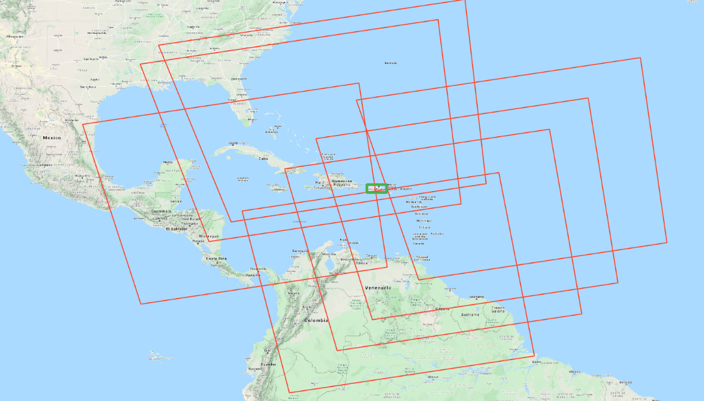

# SphereGIS:

When working with ungridded remote sensing data, such as MOD09 or VNP03, extracting the information we are interested in from a set of granules is a challenging hurdle.
Often times we are confronted with a large set of granules that intersect our region of interest, but also contain areas we are not interested in. We therefore strive for a performant method to subset the granules to our region of interest (ROI). 

The geolocation information for the ungridded granules are typically given as WGS84 coordinates.
At sufficiently low latitudes and small enough ROIs, we may choose to treat the coordinates as an 
[Equirectangular](https://en.wikipedia.org/wiki/Equirectangular_projection) grid. 
To increase fidelity, we alternatively may choose to project our data into a locally valid grid.
For both approaches, we then may use well understood 2D subsetting and indexing techniques (such as manual bounding boxes or [r-trees](https://en.wikipedia.org/wiki/R-tree)).

However, if our ROI increases in size (or is closer to the poles for the Equirectangular grid), we may tap into situation where it matters if we perceive the ROI's edges as great circles or as Rhumb lines.
Further, if our ROI consists of a spatially spread set of polygons, the approach of projecting into locally valid grids becomes tedious. 

A more preferable approach determines spatial relations with a consistent method without the need for map projections, whilst conceiving the boundaries of our ROI as great circles.

## Given are:

* A very large set of points p.
* A spherical polygon P defined by its nodes N and its edges E.

## Goal:
* Find is the subset of p that are within P.
* Avoid 2D projection. All spatial relation tests are on sphere. 
* Do the above in a performantly fashion allowing to subset trillions of points on consumer hardware (consciously vague specs).

## Challenge: 
Both the points and the polygon are on the surfaces of a sphere (rather than in a cartesian space), which means that the nodes N are great circles rather than rhumb lines.

Point-in-polygon tests on a sphere are similar to point-in-polygon tests in cartesian space ([Locating a point on a spherical surface relative to a spherical polygon of arbitrary shape](http://doi.org/10.1007/BF00894449)), but appear to be more computationally expensive. PostGIS implements spherical point-in-polygon tests through [geographies](https://postgis.net/workshops/postgis-intro/geography.html).
To make it feasible to determine the subset of a very large set of p that is within P, we want to reduce the search space by cropping the set of points to candidates points prior to the spherical point-in-polygon tests.

# Approach:
There seems to be an opportunity to quickly retrieve candidate points through intersects test with the spherical convex hull of the polygon:

* A point that is within a polygon is also within the polygon's convex hull.
* The edges of a spherical convex hull are all great circles. 
* A great circles that passes through two points is the cross product of the two points.
* A great circle can be seen as a plane dividing the sphere into two hemispheres.
* A point is within the convex hull if it is in each of the hemispheres defined by each convex edge.
* A pint is on the hemisphere described by a great circles if the dot product of the great circles and the point is positive.

### Brute Force
A brute-force approach to retrieve the spherical convex hull is (as described on [stackoverflow](https://stackoverflow.com/a/60958182)):

* Consider all nodes of the polygon.
* Draw edges between each node. I.e. create a great circle that crosses each pair of nodes. Note: Draw them in both directions
* For each of the just created great circles, verify if all nodes are on the hemisphere defined by the great circle. If yes, this great circle is an edge/constraint of the convex hull. If no, discard the great circle.

This approach works well for sufficiently small polygons (< 1000 nodes) and is implemented using numpy in [contrib/convexHullNP.ipynb](https://github.com/NiklasPhabian/SphereGIS/blob/master/contrib/convexHullNP.ipynb)

### Adapted Graham Scan 
We here implement an iterative approach through a spherical adaptation of the [Graham Scan](https://en.wikipedia.org/wiki/Graham_scan):

1. We define the edges of the convex hull to have a direction; i.e. going FROM a node TO a node. 
2. We find a first pair of nodes (a FROM and a TO node) that are an edge of the convex hull. Since we know that at least one of the polygon's edges is also an edge of the convex, we can look for the first edge of the convex in the edges of the polygon.
3. We declare the TO node as the next FROM node.
4. For this FROM node, we find its TO node. We do this by scanning all of the polygon nodes (except for the ones that already have been declared a TO node; but this is merely an optimization). We can discard a candidate convex edge as soon as we find a single point that is outside of its hemisphere.
5. We repeat step 3 and 4 until the TO node equals our very first FROM node, i.e. the convex hull is closed.

### Further improvements through sorting:
Conceptually, a FROM node's TO node is probably geographically close, which probably means also close in index space. The initial sorting of the nodes therefore appears relevant.

# Usage:
There are a set of notebooks in the contrib folder that illustrate the usage.

## Lookup of convex hull from ECEF vectors
    import sphereGIS 
    import geopandas
    
    polygon = geopandas.read_file('data/santa_barbara.gpkg')
    
    lon = numpy.array(polygons.iloc[0].geometry.exterior.xy[0])
    lat = numpy.array(polygons.iloc[0].geometry.exterior.xy[1])

    x = numpy.cos(lon/360*math.pi*2) * numpy.cos(lat/360*math.pi*2)
    y = numpy.sin(lon/360*math.pi*2) * numpy.cos(lat/360*math.pi*2)
    z = numpy.sin(lat/360*math.pi*2)
    
    convex_node_indices = sphereGIS.xyz2convex(x,y,z)

# Installing:

## From directory:

    pip install -e $DIRECTORY/

    
## From github

    pip install git+git//github.com/NiklasPhabian/SphereGIS.github

# Manual build
    
    python3 setup.py build_ext --inplace
    python3 setup.py build --force 
